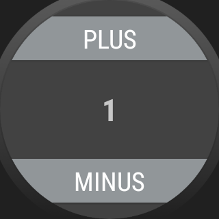

# WearOS-App: "Tally Counter"

Android-Studio-Project for a WearOS-App representing a "tally counter".

Clone or download this repository, then open the project with option 
"Open an existing Android Studio project" on Android Studio's Welcome screen.

The identifiers and comments not generated by Android Studio are in German,
so it is easier to see what the programmer had to add.

The repository contains several variations of the app in different branches.

----
## Screenshots

